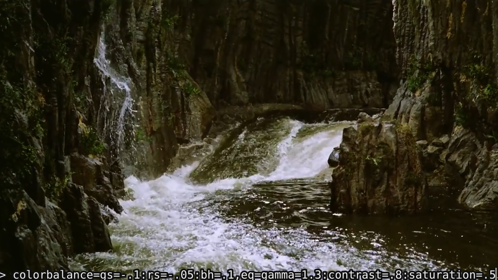

# mpv-live-filters

A lua script for mpv that lets you add, remove and toggle ffmpeg video filters during mpv playback. Designed to easily test ffmpeg's command line filters without having to start and stop `ffplay` commands or use a bloated NLE. 

This script is based on on James Ross-Gowan's [mpv-repl](https://github.com/rossy/mpv-repl) and Olivier Perret's [mpv-scripts](https://github.com/occivink/mpv-scripts), tuned specifically for streamlined use of filters. 

## Setup 

Place lua file in mpv's scripts directory. In Linux this will be `/home/user/.config/mpv/scripts/`. mpv loads all scripts in this directory when it starts. 

Alternatively, specify the path to this script from the command line with `mpv video.mkv --script /path/to/live-filters.lua`. 

## Usage

Default key-bindings:

- `` ` ``           toggle REPL for filter inputs
- `ctrl+z`          undo last filter
- `ctrl+shift+z`    re-do filter
- `ctrl+x`          toggle filters on/off
- `ctrl+shift+x`    clear all filters

REPL mode key-bindings:

- `esc`             exit REPL input mode
- `tab`             autocomplete from list of ffmpeg filters
- `enter`           add vf filter
- `alt+enter`       set vf filter (removes current filters)

See source for details on text-entry key-bindings for REPL -- they should be straightforward. 

In REPL mode, most key-bindings that use alt/ctrl/super modifier keys continue to work, but key-bindings that do not are temporarily disabled (so that it is possible to enter text).

## License

MIT